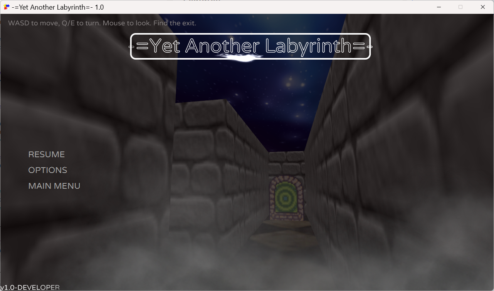

# Yet Another Labyrinth

A small first‑person labyrinth game built with Java 21, JavaFX 21 (3D) and FXGL. A randomized maze is generated each level; find the animated exit to advance. The game features textured 3D walls/floor/ceiling, ambient lighting, footstep sounds, and background music for the menu and in‑game.

## Features
- Procedural maze generation (randomized DFS/backtracker)
- First‑person movement with collision against the maze grid
- Mouse look with pointer‑lock style recentering and hidden cursor
- WASD movement + Q/E turning, footstep sounds while moving
- Animated exit marker; reaching it advances to the next, larger maze
- Single fat JAR build via ShadowJar and a jlink runtime image per platform

## Requirements
- JDK 21 (Java 21). The Gradle wrapper is included; no local Gradle install required.
- A platform supported by JavaFX 21. The build config selects JavaFX artifacts for your OS.

## Project layout
- Main class: `com.kayar.yetanotherlabyrinth.LabyrinthApp`
- Maze generation: `com.kayar.yetanotherlabyrinth.MazeGenerator`
- First‑person controller: `com.kayar.yetanotherlabyrinth.FirstPerson3DControl`
- Assets: `src/main/resources/assets` (textures and sounds)

## Run from source
Use the included Gradle wrapper from a terminal in the project root.

- Windows:
  - `.\gradlew.bat run`
- macOS/Linux:
  - `./gradlew run`

Note: The build prints the detected JavaFX platform classifier. You can override it if needed, e.g. `-PjavafxPlatform=win`.

## Build distributables
- Fat JAR (includes all dependencies):
  - Windows: `.\gradlew.bat shadowJar`
  - macOS/Linux: `./gradlew shadowJar`
  - Result: `build\libs\yetanotherlabyrinth-1.0-SNAPSHOT.jar`
  - Run it with: `java -jar build\libs\yetanotherlabyrinth-1.0-SNAPSHOT.jar`

- jlink runtime image (OS‑specific, includes a minimal JRE):
  - Windows: `.\gradlew.bat jlinkZip`
  - macOS/Linux: `./gradlew jlinkZip`
  - Result ZIP under `build\distributions\yetanotherlabyrinth-<platform>.zip`
  - Unzip, then run the launcher in the `bin` folder (on Windows: `yetanotherlabyrinth.bat`).

Tip: You may specify the JavaFX platform explicitly when building: `-PjavafxPlatform=win|mac|linux`.

## Controls
- W / A / S / D — move
- Q / E — turn left/right
- Mouse — look around (cursor hidden and recentered)

If mouse capture isn’t available on your system, the game falls back to relative mouse movement without recentering.

## Gameplay
- Each level generates a new maze. Start near the top‑left; the exit is near the bottom‑right.
- Reach the animated exit to advance to the next level; mazes get larger over time.

## Troubleshooting
- Ensure you are running on Java 21. If you see JavaFX errors, verify that the selected JavaFX platform matches your OS. You can pass `-PjavafxPlatform=win|mac|linux` to Gradle tasks.
- Some environments may restrict JavaFX media playback; background music is optional and the game continues if media fails to load.

## Credits and licenses
- Built with [FXGL](https://github.com/AlmasB/FXGL) and JavaFX.
- Included textures and sounds are for demonstration purposes as part of this project.

---

Development notes:
- Build logic: see `build.gradle.kts`. The project targets Java 21, uses ShadowJar for a fat JAR and the `org.beryx.jlink` plugin for runtime images.
- Main module entry: `com.kayar.yetanotherlabyrinth.LabyrinthApp`.
